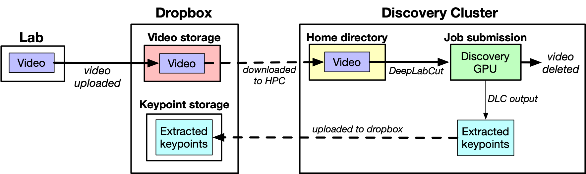
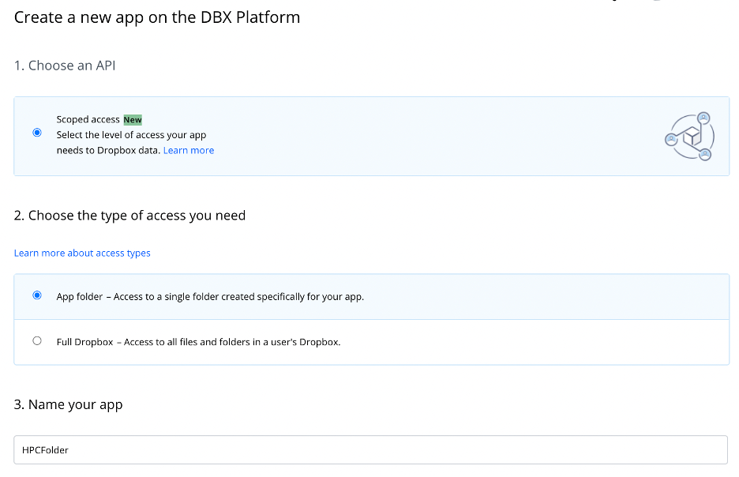
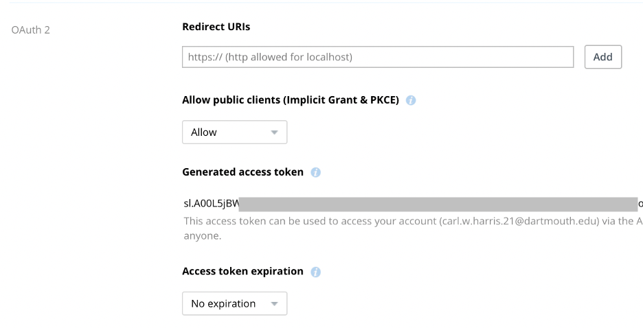

# Discovery-DLC-processing

The purpose of this project is to enable the extraction of animal keypoints from very large video datasets via DeepLabCut, on the Dartmouth College [Discovery](https://rc.dartmouth.edu/index.php/discovery-overview/) HPC cluster. All repository code, unless otherwise noted, was written by [Carl Harris](https://carlwharris.github.io/), and originally used to extract animal movement data in Professor [Peter Tse's](https://pbs.dartmouth.edu/people/peter-ulric-tse) octopus lab.

## Overview

Shown in the diagram below is a schematic of the pipeline's structure. Briefly:

1. Videos are recorded and uploaded to folder in the user's DropBox account ("Video storage"). After videos have been uploaded, the user selects the subset ("batch") from which to extract annotations for. For each video in a batch, a job is submitted to the HPC queue. 
2. For a given job, the corresponding video is first downloaded from DropBox using the user's API key (see "Setting up Dropbox" below) into the home directory
3. A trained DeepLabCut network is then used to extract keypoints from the video. In the scripts attatched, both a CPU and a GPU can be used, but running on a GPU is highly preferable since it is far faster.
4. After keypoints have been extracted, the video is deleted, to clear space for the rest of the video files in the batch to be downloaded. 
5. Extracted keypoints are uploaded to a *different* DropBox folder than the one they were stored in ("Keypoint storage")

After the batch of videos has been completed, all corresponding keypoints can be found in whichever folder is specified for keypoint storage.




## Important notes

* The barriers to entry to get everything setup are quite high. Because Dartmouth’s HPC team doesn't allow one to establish a laboratory-specific account on the cluster, you’ll need to do so on your personal account. Because of this, the learning curve for the installation phase is very steep, so I only recommend doing so if you have very (additional emphasis on “very”) large amounts of video data to process. Otherwise, you’ll be better of running things on your personal computer. It helps to have familiarity with DeepLabCut (at a minimum), which you can read about on GitHub and in the corresponding publication. 
* Both the DLC software and the HPC infrastructure are always evolving. For this reason, you might have to tweak some of my code a bit – it works as of July 2021, but minor alterations might be necessary as the systems change. 
* It’ll help to gain some background knowledge on the [HPC](https://rc.dartmouth.edu/) and [DeepLabCut](https://github.com/DeepLabCut/DeepLabCut) documentation. A little bit of reading on the links provided will go a long way towards speeding up the process. Overall, the system isn’t all that complicated, but there are a lot of moving parts for those unfamiliar with these types of infrastructures.


## Moving files to Discovery

To begin, copy and paste the contents of the `submission_scripts` folder into the home directory of your HPC account. You’ll need these files to run the pipline on the cluster.

## Setting up DropBox

The system is designed to function with Dropbox as the backbone of the data storage component of the system. Essentially, the user annotates some subset of video stored on Dropbox, which is used to train the neural network on the HPC cluster.  In order to access Dropbox from the HPC, we have to create a special type of Dropbox folder using the “Dropbox apps” feature. This folder generates a token that one can then use to access the folder without having to login via an access token. 

To create an app folder, navigate to [this](https://www.dropbox.com/developers/apps/create?_tk=pilot_lp&_ad=ctabtn1&_camp=create) link. Then, select the options shown below and create a name for your folder.

<center></center>

After creating an apps folder, you need to generate an access token. To do so, click on the corresponding button on the subsequent page, as shown below.

<center></center>

Now you can access all the contents of this Dropbox folder using MATLAB (and any other compatible program). Before you forget, paste this access token into the `DownloadVideo.m` and `UploadPickleFiles.m` files in the `submission_scripts` folder. 

## Creating annotations on local computer

After setting up Dropbox for cluster access, and saving your videos, you must then install DLC onto your personal computer. Follow the DLC documentation to see how to do this on your specific system.

Then, create a new DLC project and select some subset of your videos to manually label. If you’d like to randomize this process, you can use the `CreateInitialTrainingSet.m` script, which will select some number of videos from the folder and time period you select from an excel file, formatted as in the sample `Video_Set_Oct26.xlsx` file provided. 

After annotating your videos on your personal computer, move the project to the home folder of your HPC account. Make sure to change the project path in your .config file to its location on the cluster. This is important, otherwise DLC won’t run!

## Installing DeepLabCut on your Discovery account

After labeling your data and moving the corresponding project to your HPC folder, you again need to install DLC, this time on your cluster account. When I set this up on my account, I used DLC version 1.10, which might be a better choice than whatever “pip install deeplabcut” chooses. You should install the GPU version, because that will train magnitudes more quickly than if you only use CPU functionality. 

## Training the network on the cluster

Installing DLC on the cluster can be tricky, but after it’s been set up, training the network is simple. Use the same process as in the DLC documentation. For a .pbs file with how to train the network using a GPU, see the sample provided in `TrainNetwork.pbs`.

## Running your videos through the cluster

For those with large amounts of video data to submit, I create a batch submission program called PBSDriver.m. To submit jobs, run the command

```
matlab -nodisplay -nosplash -r ‘PBSDriver’
```

from the command line after you have ssh’ed onto your HPC account. Keep in mind that you must keep the number of jobs in your queue to less than 600 (unless you want to setup a `largeq` submission, which is easy enough to do if you closely read the HPC documentation).

This part of the pipeline will pull the selected videos from Dropbox, run them through the network trained in the previous step, and then upload the results to the Dropbox folder corresponding to the access token you specify in the `UploadPickleFiles.m` function. Keep in mind that your home HPC folder has a quota of 50 Gb – so don’t overload the system by downloading too many videos at one time!

## Closing notes

* While the installation process is time-consuming, the pipeline itself works quite well and is relatively efficient in terms of memory/network/computation resource use. We were able to extract keypoints from ~1 month of single camera 24/7 video in less than a day using the 60 processors allotted to those affiliated with the PBS department.
* Even though GPU use is vastly more efficient than using CPUs, both in terms of decreasing time and improving the allocation of computational resources, you may run into a lack of GPU availability. In these cases, particularly when running videos through the cluster (i.e., not for training the network), using CPUs with 2 processors each provides enough memory to run DLC and may decrease your total processing time (over waiting for GPUs to open up).
* Be careful about sharing code that contains access tokens – anyone who has your token can access the corresponding Dropbox app folder.
* Make sure to read through the documentation as provided in the code files. It covers the specific functions and scripts in a bit more detail than here, and might help you work out any kinks you run into.

## Author

Code, unless otherwise noted, by Carl Harris (carlwharris1 at gmail; [GitHub](https://github.com/carlwharris); [website](https://carlwharris.github.io/)). Released under [MIT license](LICENSE).


